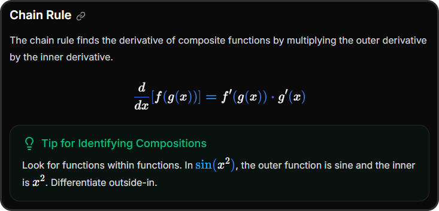
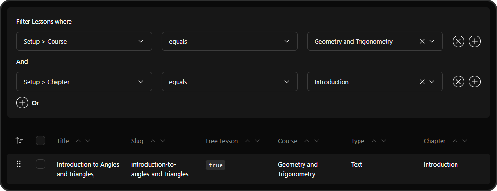
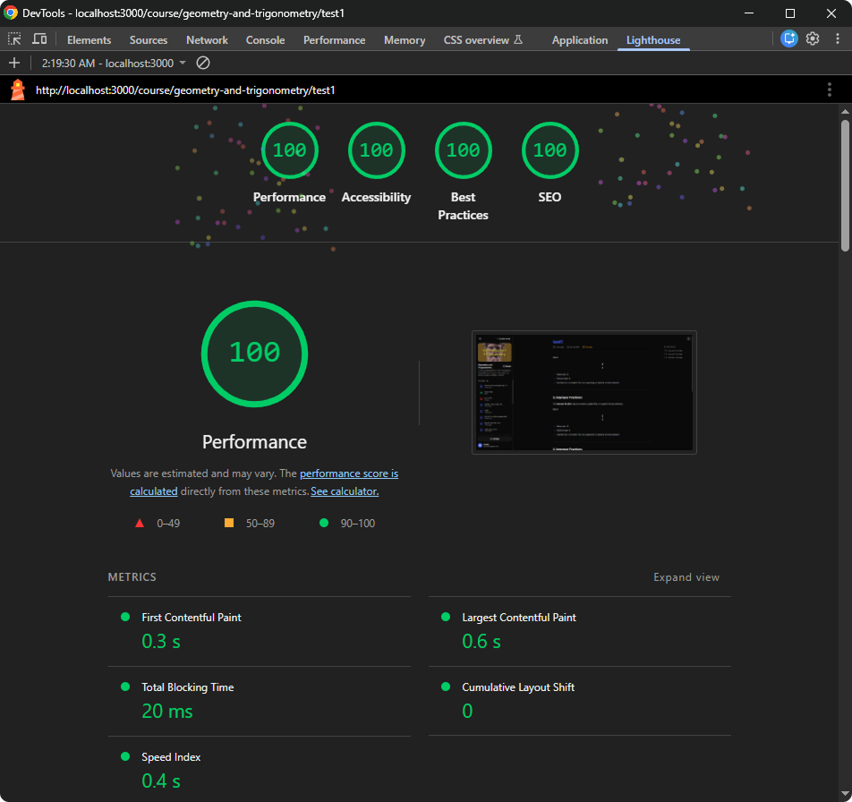

# Next.js Math Course Platform

A modern full-stack Next.js 15 platform with CMS, auth, and Stripe integration - built to manage and sell online math courses with videos, quizzes, LaTeX, and interactive graphs.


<p align="center">
<picture>
  <source media="(prefers-color-scheme: dark)" srcset="screenshots/tech-stack-dark.svg">
  <source media="(prefers-color-scheme: light)" srcset="screenshots/tech-stack-light.svg">
  
</picture>
</p>

<picture>
  <source media="(prefers-color-scheme: dark)" srcset="screenshots/landing-dark.png">
  <source media="(prefers-color-scheme: light)" srcset="screenshots/landing-light.png">
  
</picture>

<picture>
  <source media="(prefers-color-scheme: dark)" srcset="screenshots/lesson-dark.png">
  <source media="(prefers-color-scheme: light)" srcset="screenshots/lesson-light.png">
  
</picture>

## Features

- **Full Authentication** - powered by **BetterAuth**, featuring email verification via **Resend**, block for disposable emails, session limits and rate limiting with **Redis** to prevent account sharing and abuse.
- **Admin CMS Dashboard** - manage courses, lessons, and media directly through an integrated headless **Payload CMS** interface.
- **Stripe Payments** - sell courses with one-time payments using Stripe Checkout.
- **Hybrid Lesson Delivery (SSR + SSG)** - free lessons are pre-rendered for speed and SEO, while paid lessons use server-side rendering for secure, on-demand access.
- **Caching & Revalidation** - lesson and enrollment data are cached for performance and automatically refreshed via Payload CMS hooks or Stripe webhook when content or access changes.
- **Protected media** - paid lesson images restricted to enrolled users, with auto-generated blur placeholders and optional AWS S3 / Cloudflare R2 storage.
- **Mux Video Integration** - video uploads through CMS and streaming, with signed URLs ensuring only enrolled users can access paid video lessons.
- **LaTeX and Interactive Desmos Graphs** - lessons feature interactive graphs and clean LaTeX formatting, with settings like larger math font or colored symbols.

## Installation Steps

### 1. Clone the Repository

```bash
git clone https://github.com/maciekt07/nextjs-math-course
cd nextjs-math-course
```

### 2. Install Dependencies

```bash
npm install
```

### 3. Set Up Environment Variables

Create a `.env` file in the root directory. Use [.env.example](.env.example) as a template.
Environment variables are fully typed and validated for both dev and build.

### 4. Start Databases

Both PostgreSQL (for main app data) and MongoDB (for Payload CMS) run via Docker Compose

```bash
docker compose up -d
```

> [!TIP]
> View Database with Drizzle Studio
>
> ```bash
> npm run db:studio
> ```

### 5. Apply Database Migrations

```bash
npm run db:push
```

### 6. Run the Stripe webhook listener

```bash
npm run stripe:webhook
```

#### Testing Payments

Use these Stripe test card details to simulate a successful payment:

- Card Number: `4242 4242 4242 4242`
- Expiration Date: Any future date
- CVC: Any 3-digit code

### 7. Run the App

Development mode:

```bash
npm run dev
```

Production preview:

```bash
npm run preview
```

The application should now be running at [http://localhost:3000](http://localhost:3000)

### 8. Access Payload CMS Admin Panel

Once the app is running, you can access the CMS at:

[http://localhost:3000/admin](http://localhost:3000/admin)

- Create your admin account on first visit

- Use the panel to manage courses, lessons, and media

## Usage

### Using Desmos Graphs

You can add interactive [Desmos](https://www.desmos.com/calculator) graphs directly in markdown lessons:

```markdown
::desmos{url="https://www.desmos.com/calculator/your-graph-id"}
```

<picture>
  <source media="(prefers-color-scheme: dark)" srcset="screenshots/desmos-graph-dark.png">
  <source media="(prefers-color-scheme: light)" srcset="screenshots/desmos-graph-light.png">
  
</picture>

> [!NOTE]
> By default, the embedded version displays only the graph.
> If you set `noEmbed=true`, it will open the full Desmos calculator with all its tools and controls.
>
> ```markdown
> ::desmos{url="https://www.desmos.com/calculator/your-graph-id" noEmbed=true}
> ```

### Using LaTeX in Markdown

You can include math expressions in your lessons using standard Markdown + LaTeX syntax:

```markdown
Inline math: $E = mc^2$

Block math:

$$
f'(x) = \lim_{h \to 0} \frac{f(x+h) - f(x)}{h}
$$
```

For more details, see the [Markdown + LaTeX documentation](https://ashki23.github.io/markdown-latex.html#mathematical-formula)

### Using Callout Blocks

You can highlight important content or tips using custom callout blocks like `note`, `tip`, `important`, `warning`, `card`.

```markdown
:::note
This is a note
:::

:::tip{title="Remember"}
This is a tip with a custom title
:::
```

<picture>
  <source media="(prefers-color-scheme: dark)" srcset="screenshots/callout-block-dark.png">
  <source media="(prefers-color-scheme: light)" srcset="screenshots/callout-block-light.png">
  
</picture>

### Reordering Lessons

1. Go to the **[Lessons](http://localhost:3000/admin/collections/lessons)** collection in the CMS.
2. In the top-right, open **Filters → Add Filter**.
3. Select **course → equals → your course**.
4. Use drag-and-drop to reorder the filtered lessons.

<picture>
  <source media="(prefers-color-scheme: dark)" srcset="screenshots/sort-filter-dark.png">
  <source media="(prefers-color-scheme: light)" srcset="screenshots/sort-filter-light.png">
  
</picture>

## Performance



### Math rendering

In paid lessons, math formulas are rendered lazily on the client as it scrolls into view, preventing main-thread blocking and avoiding FPS drops on long pages with many formulas. Free lessons are fully SSGed, which requires no special optimization and also benefits SEO.

## Credits

Illustrations used in this project are from [Storyset](https://storyset.com/), modified for personal use.

**Made with ❤️ by [maciekt07](https://github.com/maciekt07), licensed under [MIT](/LICENSE)**
