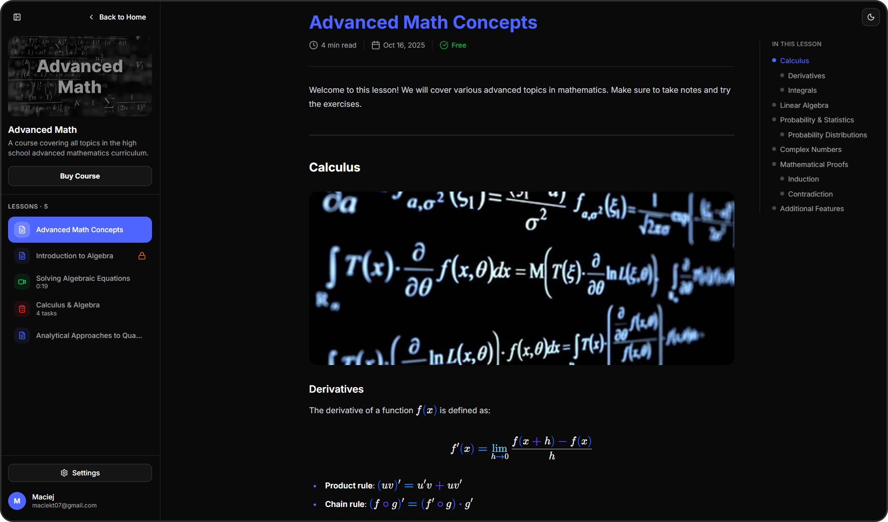
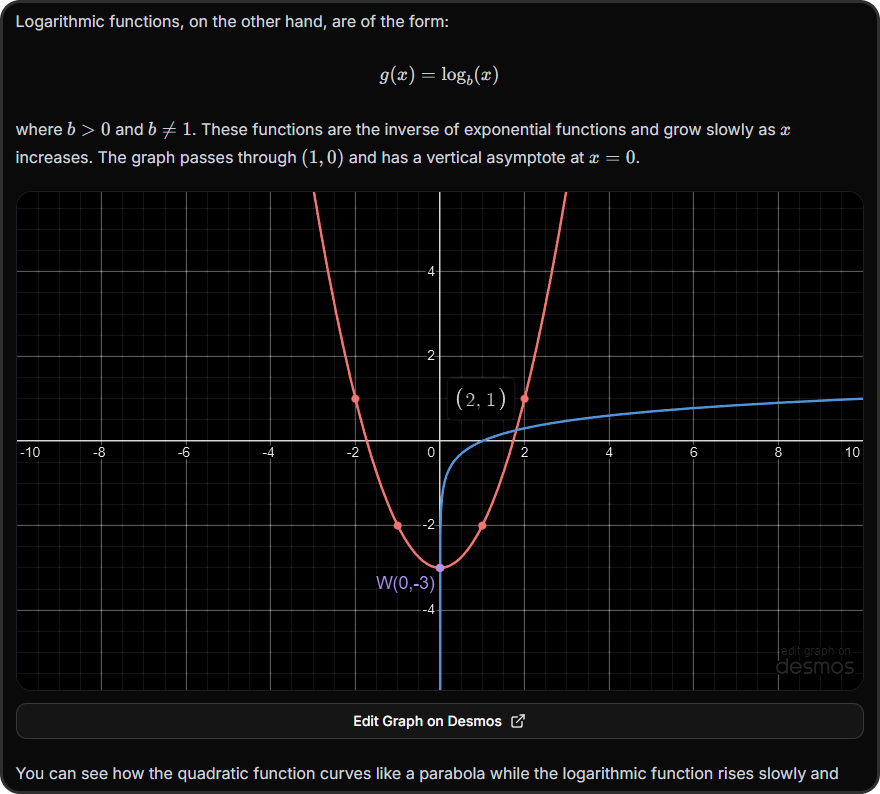

# Next.js Math Course Platform

A modern full-stack Next.js 15 platform with CMS, auth, and Stripe integration - built to manage and sell online math courses with videos, quizzes, LaTeX, and interactive graphs.


<p align="center">
<picture>
  <source media="(prefers-color-scheme: dark)" srcset="screenshots/tech-stack-dark.svg">
  <source media="(prefers-color-scheme: light)" srcset="screenshots/tech-stack-light.svg">
  
</picture>
</p>

<picture>
  <source media="(prefers-color-scheme: dark)" srcset="screenshots/landing-dark.png">
  <source media="(prefers-color-scheme: light)" srcset="screenshots/landing-light.png">
  
</picture>

<picture>
  <source media="(prefers-color-scheme: dark)" srcset="screenshots/lesson-dark.png">
  <source media="(prefers-color-scheme: light)" srcset="screenshots/lesson-light.png">
  
</picture>

## Features

- **Full Authentication with BetterAuth** - secure login, registration, and email verification powered by **Resend**.
- **Admin CMS Dashboard** - manage courses, lessons, and media directly through an integrated **Payload CMS** interface.
- **Stripe Payments** - sell courses with one-time payments using Stripe Checkout.
- **Hybrid Lesson Delivery (SSR + SSG)** - free lessons are pre-rendered for speed, while paid lessons use server-side rendering for secure, on-demand access.
- **Protected media** – paid lesson images restricted to enrolled users, with optional AWS S3 / Cloudflare R2 storage
- **Blurred Image Placeholders** – images load fast with smooth, auto-generated blur previews.
- **Mux Video Integration** – video uploads and streaming through CMS, with signed URLs ensuring only enrolled users can access paid video lessons.
- **LaTeX and Interactive Desmos Graphs** – Lessons feature interactive graphs and clean LaTeX formatting, with settings like larger math font or colored symbols

## Requirements

- **Node.js** (v18 or higher)
- **npm** package manager
- **Docker Desktop**
- **Git**

## Installation Steps

### 1. Clone the Repository

```bash
git clone https://github.com/maciekt07/nextjs-math-course
cd nextjs-math-course
```

### 2. Install Dependencies

```bash
npm install
```

### 3. Set Up Environment Variables

Create a `.env` file in the root directory. Use [.env.example](.env.example) as a template.

### 4. Start Databases

Both PostgreSQL (for main app data) and MongoDB (for Payload CMS) run via Docker Compose

```bash
docker compose up -d
```

To verify the database is running:

```bash
docker compose ps
```

### 5. Run the Stripe webhook listener

```bash
npm run stripe:webhook
```

### 6. Start the Development Server

```bash
npm run dev
```

The application should now be running at [http://localhost:3000](http://localhost:3000)

### 7. Access Payload CMS Admin Panel

Once the app is running, you can access the CMS at:

[http://localhost:3000/admin](http://localhost:3000/admin)

- Create your admin account on first visit

- Use the panel to manage courses, lessons, and media

## Usage

### Using Desmos Graphs

You can add interactive [Desmos](https://www.desmos.com/calculator) graphs directly in markdown lessons:

```markdown
::desmos{url="https://www.desmos.com/calculator/your-graph-id"}
```

<picture>
  <source media="(prefers-color-scheme: dark)" srcset="screenshots/desmos-graph-dark.png">
  <source media="(prefers-color-scheme: light)" srcset="screenshots/desmos-graph-light.png">
  
</picture>

By default, the embedded version displays only the graph.
If you set `noEmbed=true`, it will open the full Desmos calculator with all its tools and controls.

```markdown
::desmos{url="https://www.desmos.com/calculator/your-graph-id" noEmbed=true}
```

### Using LaTeX in Markdown

You can include math expressions in your lessons using standard Markdown + LaTeX syntax:

```markdown
Inline math: $E = mc^2$

Block math:

$$
f'(x) = \lim_{h \to 0} \frac{f(x+h) - f(x)}{h}
$$
```

For more details, see the [Markdown + LaTeX documentation](https://ashki23.github.io/markdown-latex.html#mathematical-formula)

## Database Management

### Access PostgreSQL CLI

```bash
docker compose exec db psql -U postgres -d math_course
```

### View Database with Drizzle Studio

```bash
npm run db:studio
```

This opens a visual database browser at [https://local.drizzle.studio](https://local.drizzle.studio)

### Stop the Database

```bash
docker compose down
```

## Credits

Illustrations used in this project are from [Storyset](https://storyset.com/), modified for personal use.

**Made with ❤️ by [maciekt07](https://github.com/maciekt07), licensed under [MIT](/LICENSE)**
