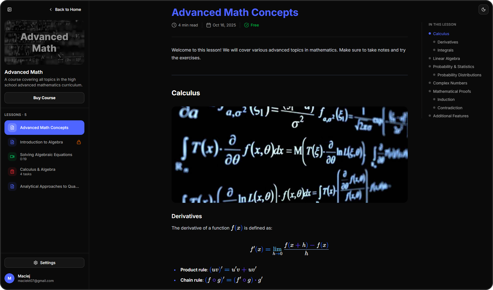
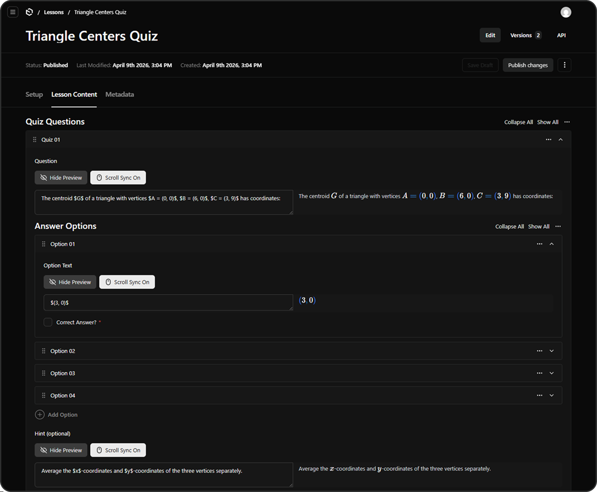
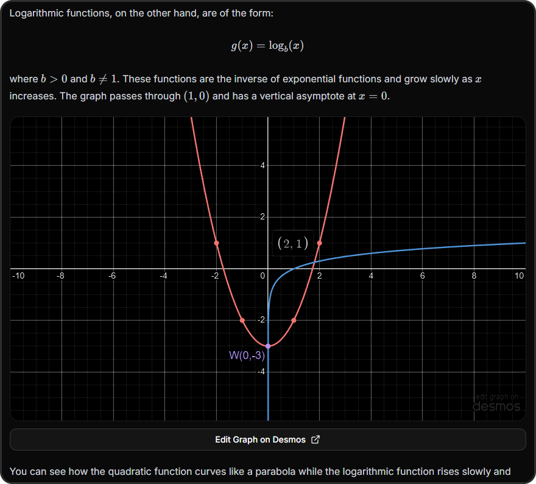
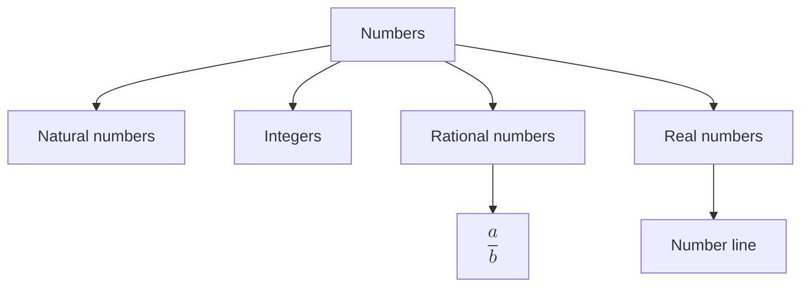
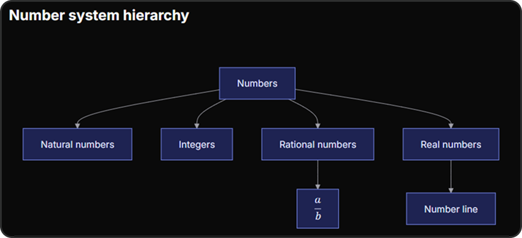
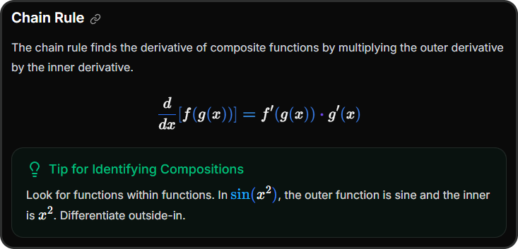
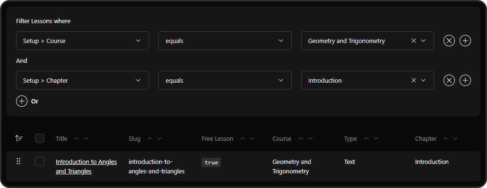
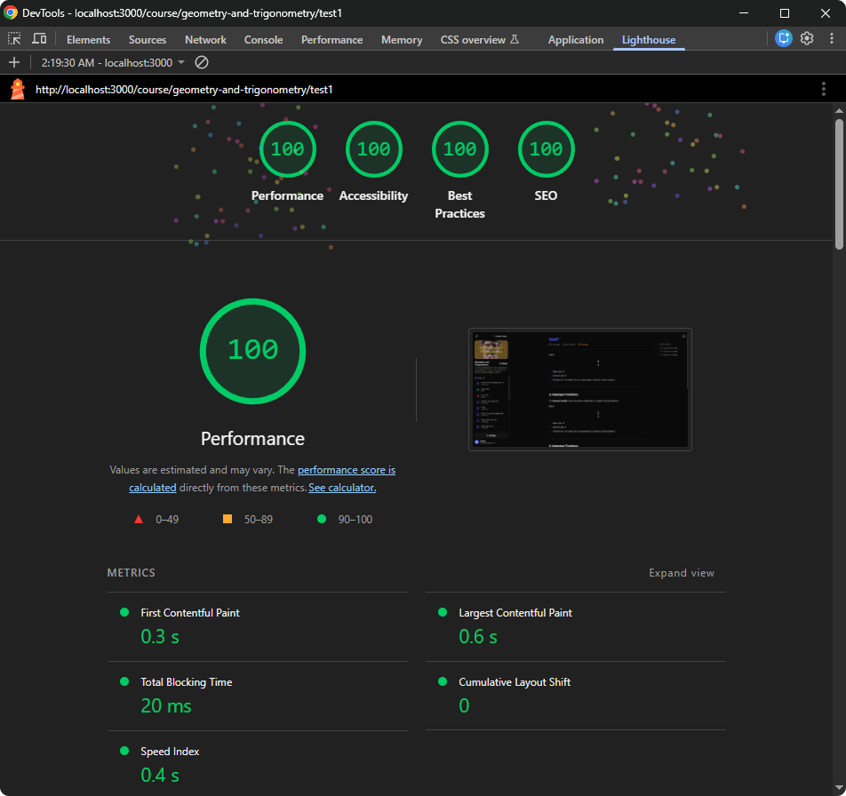

# Next.js Math Course Platform

A modern full-stack Next.js 16 platform with CMS, auth, and Stripe integration - built to manage and sell online math courses with videos, quizzes, LaTeX, and interactive graphs.

## Live Demo: [https://nextjs-math-course.vercel.app/](https://nextjs-math-course.vercel.app/)


<p align="center">
<picture>
  <source media="(prefers-color-scheme: dark)" srcset="screenshots/tech-stack-dark.svg">
  <source media="(prefers-color-scheme: light)" srcset="screenshots/tech-stack-light.svg">
  
</picture>
</p>

<picture>
  <source media="(prefers-color-scheme: dark)" srcset="screenshots/landing-dark.png">
  <source media="(prefers-color-scheme: light)" srcset="screenshots/landing-light.png">
  
</picture>

<picture>
  <source media="(prefers-color-scheme: dark)" srcset="screenshots/lesson-dark.png">
  <source media="(prefers-color-scheme: light)" srcset="screenshots/lesson-light.png">
  
</picture>

<picture>
  <source media="(prefers-color-scheme: dark)" srcset="screenshots/cms-quiz-dark.png">
  <source media="(prefers-color-scheme: light)" srcset="screenshots/cms-quiz-light.png">
  
</picture>

## Features

- **Full Authentication** - powered by **BetterAuth**, featuring Google OAuth, Google One Tap, email verification & password reset via **Resend**. Includes block for disposable emails, last used method badge, session limits and rate limiting with **Redis** to prevent account sharing and abuse.
- **Admin CMS Dashboard** - manage courses, lessons, and media directly through an integrated headless **Payload CMS** interface with drafts and version history.
- **MCP integration** - a Model Context Protocol server lets AI clients like Claude draft, edit, and review lesson content directly against the CMS.
- **Stripe Payments** - sell courses with one-time payments using Stripe Checkout.
- **Hybrid Lesson Delivery (SSR + SSG)** - free lessons are pre-rendered for speed and SEO, while paid lessons use server-side rendering for secure, on-demand access.
- **Caching & Revalidation** - lesson and enrollment data are cached for performance and automatically refreshed via Payload CMS hooks or Stripe webhook when content or access changes.
- **Media storage** - dual-bucket setup on AWS S3 / Cloudflare R2: public assets (course posters, free lesson images) served directly from the CDN for speed, and protected assets (paid lesson images) served through presigned URLs restricted to enrolled users, both with auto-generated blur placeholders.
- **Mux Video Integration** - video uploads through CMS and streaming; paid lessons use signed URLs restricted to enrolled users, free lessons stream publicly.
- **Rich Lesson Content** - lessons are authored in Markdown with LaTeX math, interactive Desmos graphs, and custom elements like callout blocks, with settings like larger math font or colored symbols.
- **SEO Optimization** - OG image generation, XML sitemap with per-lesson metadata (images, video thumbnails, duration, descriptions) for published free lessons.

## Development

### Clone the Repository

```bash
git clone https://github.com/maciekt07/nextjs-math-course
cd nextjs-math-course
```

### Install Dependencies

```bash
pnpm install
```

### Set Up Environment Variables

Create a `.env.development` file in the root directory. Use [.env.example](.env.example) as a template.
Environment variables are fully typed and validated for both dev and build. For production preview, use `.env.production` file.

### Start Databases

Both PostgreSQL (for main app data) and MongoDB (for Payload CMS) run via Docker Compose

```bash
pnpm docker:dev
```

> [!TIP]
> View Database with Drizzle Studio
>
> ```bash
> pnpm db:studio
> ```

### Apply Database Migrations

```bash
pnpm db:push
```

### Run the Stripe webhook listener

```bash
pnpm stripe:webhook
```

#### Testing Payments

Use these Stripe test card details to simulate a successful payment:

- Card Number: `4242 4242 4242 4242`
- Expiration Date: Any future date
- CVC: Any 3-digit code

### Run the App

Development mode:

```bash
pnpm dev
```

Production preview:

```bash
pnpm preview
```

The application should now be running at [http://localhost:3000](http://localhost:3000)

### Access Payload CMS Admin Panel

Once the app is running, you can access the CMS at:

[http://localhost:3000/admin](http://localhost:3000/admin)

- Create your admin account on first visit

- Use the panel to manage courses, lessons, and media

### Preview Emails

Start the React Email preview server to view and test email templates locally:

```bash
pnpm email:dev
```

## Usage

### Using MCP Server

The CMS exposes an MCP server for managing `lessons`, `chapters`, and `courses`

**1. Generate an API key**

Go to `/admin` → **MCP → API Keys** → **Create New**, enable the required collections/operations, save, and copy the generated key.

**2. Connect your MCP client**

Claude Code example:

```bash
claude mcp add --transport http Math-Course-CMS http://127.0.0.1:3000/api/mcp \
  --header "Authorization: Bearer MCP-USER-API-KEY"
```

Changes will be automatically saved as draft with version control.

### Using Desmos Graphs

You can add interactive [Desmos](https://www.desmos.com/calculator) graphs directly in markdown lessons:

```markdown
::desmos{url="https://www.desmos.com/calculator/your-graph-id"}
```

<picture>
  <source media="(prefers-color-scheme: dark)" srcset="screenshots/desmos-graph-dark.png">
  <source media="(prefers-color-scheme: light)" srcset="screenshots/desmos-graph-light.png">
  
</picture>

> [!NOTE]
> By default, the embedded version displays only the graph.
> If you set `noEmbed=true`, it will open the full Desmos calculator with all its tools and controls.
>
> ```markdown
> ::desmos{url="https://www.desmos.com/calculator/your-graph-id" noEmbed=true}
> ```

### Using LaTeX in Markdown

You can include math expressions in your lessons using standard Markdown + LaTeX syntax:

```markdown
Inline math: $E = mc^2$

Block math:

$$
f'(x) = \lim_{h \to 0} \frac{f(x+h) - f(x)}{h}
$$
```

For more details, see the [Markdown + LaTeX documentation](https://ashki23.github.io/markdown-latex.html#mathematical-formula)

### Using Mermaid Diagrams

You can add [Mermaid](https://mermaid.js.org/intro/) diagrams directly in your markdown lessons:

````markdown

```mermaid
flowchart TD
    A["Numbers"] --> B["Natural numbers"]
    A --> C["Integers"]
    A --> D["Rational numbers"]
    A --> E["Real numbers"]

    D --> F["$$\frac{a}{b}$$"]
    E --> G["Number line"]
```
````

<picture>
  <source media="(prefers-color-scheme: dark)" srcset="screenshots/diagram-dark.png">
  <source media="(prefers-color-scheme: light)" srcset="screenshots/diagram-light.png">
  
</picture>

### Using Callout Blocks

You can highlight important content or tips using custom callout blocks like `note`, `tip`, `important`, `warning`, `card`.

```markdown
:::note
This is a note
:::

:::tip{title="Remember"}
This is a tip with a custom title
:::
```

<picture>
  <source media="(prefers-color-scheme: dark)" srcset="screenshots/callout-block-dark.png">
  <source media="(prefers-color-scheme: light)" srcset="screenshots/callout-block-light.png">
  
</picture>

### Reordering Lessons

1. Go to the **[Lessons](http://localhost:3000/admin/collections/lessons)** collection in the CMS.
2. In the top-right, open **Filters → Add Filter**.
3. Select **course → equals → your course**.
4. Use drag-and-drop to reorder the filtered lessons.

<picture>
  <source media="(prefers-color-scheme: dark)" srcset="screenshots/sort-filter-dark.png">
  <source media="(prefers-color-scheme: light)" srcset="screenshots/sort-filter-light.png">
  
</picture>

## Performance



### Math rendering

In paid lessons, math formulas are rendered lazily on the client as it scrolls into view, preventing main-thread blocking and avoiding FPS drops on long pages with many formulas. Free lessons are fully SSGed, which requires no special optimization and also benefits SEO.

Pages are also automatically split into semantic `<section>` tags. Each section uses `content-visibility: auto`, allowing the browser to skip rendering off-screen content until it is needed.

## Credits

Illustrations used in this project are from [Storyset](https://storyset.com/), modified for personal use.

**Made with ❤️ by [maciekt07](https://github.com/maciekt07), licensed under [MIT](/LICENSE)**
