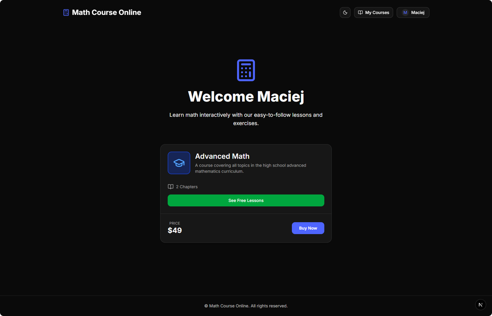
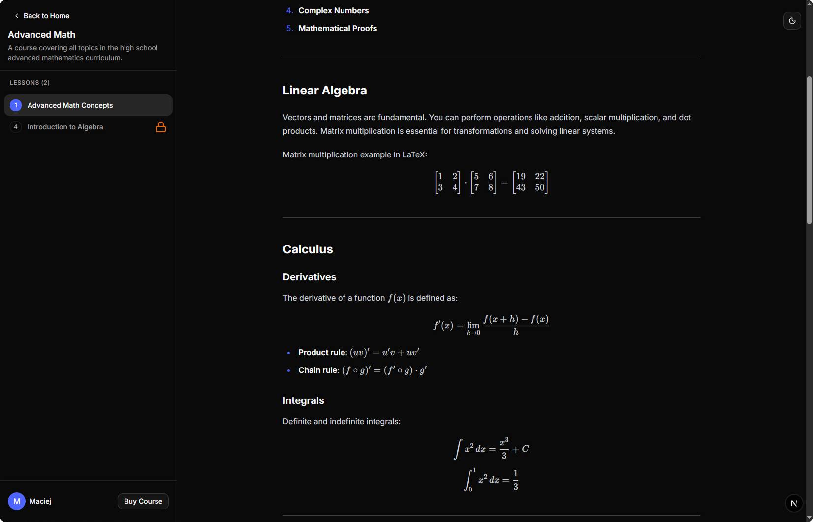

# Next.js Math Course Platform

Full-stack Next.js platform with CMS and auth - built for managing and selling online math courses.


<p align="center">

</p>





## Features

- Full authentication system with BetterAuth, including email verification using Resend
- Admin CMS panel for managing courses and lessons via Payload CMS
- Drizzle ORM integration for database management
- Tailwind + Shadcn UI components

## Requirements

- **Node.js** (v18 or higher)
- **npm** package manager
- **Docker Desktop** (for PostgreSQL database)
- **Git**

## Installation Steps

### 1. Clone the Repository

```bash
git clone https://github.com/maciekt07/nextjs-math-course
cd nextjs-math-course
```

### 2. Install Dependencies

```bash
npm install
```

### 3. Set Up Environment Variables

Create a `.env` file in the root directory. Use [.env.example](.env.example) as a template.

### 4. Start Databases

Both PostgreSQL (for main app data) and MongoDB (for Payload CMS) run via Docker Compose

```bash
docker-compose up -d
```

To verify the database is running:

```bash
docker-compose ps
```

### 5. Start the Development Server

```bash
npm run dev
```

The application should now be running at [http://localhost:3000](http://localhost:3000)

### 6. Access Payload CMS Admin Panel

Once the app is running, you can access the CMS at:

[http://localhost:3000/admin](http://localhost:3000/admin)

- Create your admin account on first visit

- Use the panel to manage courses, lessons, and users

## Database Management

### Access PostgreSQL CLI

```bash
docker-compose exec db psql -U postgres -d math_course
```

### View Database with Drizzle Studio

```bash
npm run db:studio
```

This opens a visual database browser at [https://local.drizzle.studio](https://local.drizzle.studio)

### Stop the Database

```bash
docker-compose down
```

## Credits

Made with ❤ by [maciekt07](https://github.com/maciekt07), licensed under [MIT](/LICENSE)
